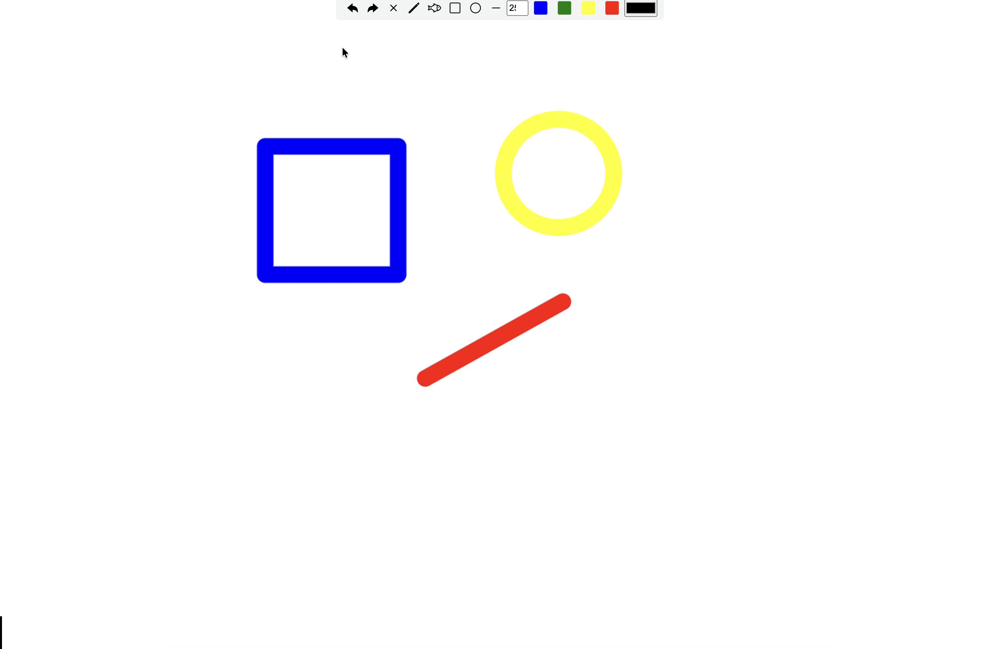

# SketchBoard 🎨

A feature-rich whiteboard application built using **Vanilla JavaScript** and the **HTML5 Canvas API**.

CanvasBoard allows users to draw freely, create shapes, erase content, and manage drawings with undo/redo functionality — all inside a responsive canvas.

## 🚀 Live Demo

You can try the project here:

🔗 [Try SketchBoard](https://sketchboard013.netlify.app/)

Or run it locally by cloning the repository.

## 📸 Preview



## 🎥 Demo Video

Watch the project in action:

<video width="100%" controls>
  <source src="./assets/preview-video.mp4" type="video/mp4">
</video>

## ✨ Features

* ✏️ Freehand Drawing Tool
* 🧽 Eraser Tool
* ⬛ Rectangle Tool
* ⭕ Ellipse Tool
* 📏 Line Tool
* 🎨 Color Picker
* 🖌️ Adjustable Brush Size
* ↩️ Undo / Redo Functionality
* 🗑️ Clear Canvas
* 📱 Mouse + Touch Support
* 🔄 Responsive Canvas Resize Support

## 🛠️ Tech Stack

* **HTML5**
* **CSS3**
* **JavaScript (Vanilla JS)**
* **Canvas API**

## ⚙️ Run Locally

Clone the repository:

```bash
git clone https://github.com/Simran-Sobhani/sketch-board
```

Open the project folder:

```bash
cd canvas-board
```

Run the project by opening:

```txt
index.html
```

in your browser.

## 🧠 Challenges Solved

While building this project, I worked through several real-world canvas problems such as:

* Maintaining drawings during canvas resize
* Implementing undo/redo using redraw architecture
* Handling eraser functionality with `globalCompositeOperation`
* Building smooth shape previews
* Managing canvas redraw without breaking drawings

## 🔮 Future Improvements

* Add Text Tool
* Export Canvas as Image
* Add More Shapes
* Improve UI/UX

## 👨‍💻 Author

Built by **Simran Sobhani**
